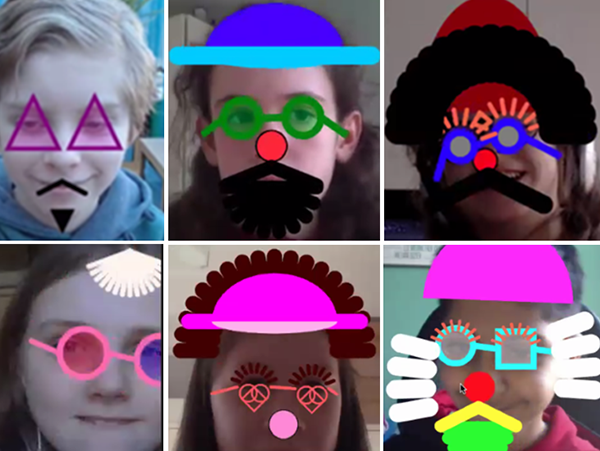

# P5 Dress your Face with Code Workshop

In this workshop, face recognition is used to identify parts of the face.  Then using P5 drawing functions, various face adornments can be added.

Uses P5.js with ml5.js for face recognition.

1. Dress your Face Template
Template code for the sessions.

2. Dress your Face Key Points
Code to show all key points on the face.

3. Dress your Face Solution
Solution code using ready-made adornments code.

4. Dress your Face Solution 2
Solution code using P5 shapes (new version of workshop)